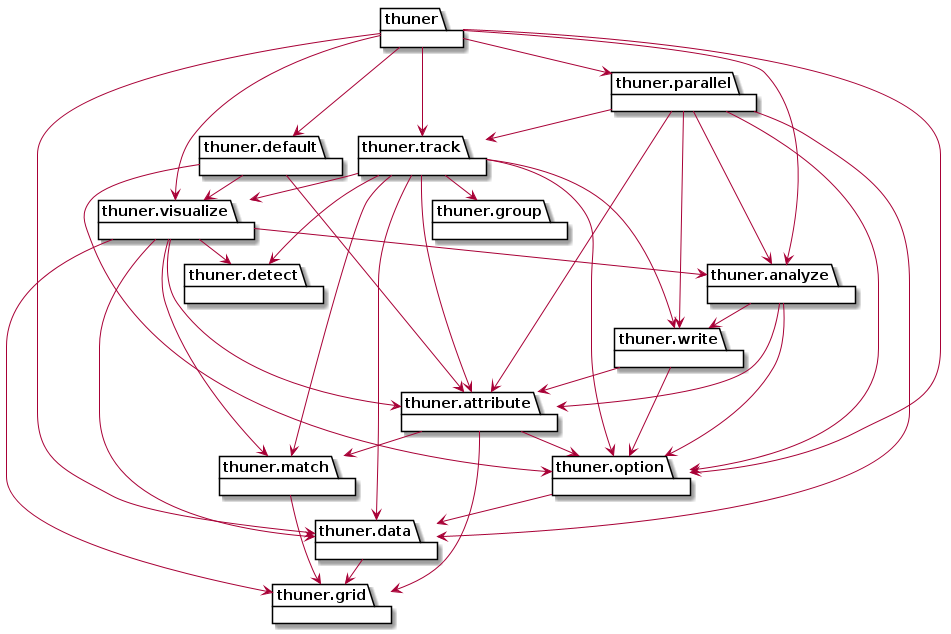

Introduction
============================================================================

History
---------------------------------------------------------------------------
The Thunderstorm Event Reconnaissance (THUNER) package began as a 
`fork <https://github.com/THUNER-project/TINT>`__ of the 
`TINT is not TITAN (TINT) <https://github.com/openradar/TINT>`__
package. This fork was referred to as Mesoscale TINT (MINT) in the 
`scientific literature <https://doi.org/10.1175/MWR-D-22-0146.1>`__. 
MINT worked by identifing multiple objects associated with a single storm 
(e.g. convective and stratiform echoes), and grouping these together into new storm "system" 
objects. Tracking was then performed on these grouped objects, rather than the 
compenent objects. During tracking, MINT also "tagged" storm objects with 
attributes from other datasets, e.g. ambient wind and temperature fields from the 
European Centre for Medium-Range Weather Forecasts (ECMWF) reanalysis. 

As development progressed the MINT codebase became increasingly cumbersome,
and the need for a more flexible and extensible package, generalising the MINT approach,
became apparent. While reimplementation into other existing packages was considered, 
ultimately it was simpler to re-design and re-write the MINT codebase from scratch,
forming THUNER. 

Objectives
--------------------------------------------------------------------------------
THUNER's goals include the following.

#. **To be input agnostic.** Storm tracking algorithms were originally developed
   for radar, but today one must also apply such algorithms to large radar mosaic, 
   satellite and model datasets. 
   `Some workflows <https://doi.org/10.1175/JCLI-D-19-0137.1>`__ require different 
   datasets for different attributes of the same object, e.g. satellite for stratiform 
   cloud and radar for convective cloud.
#. **To support distinct methodologies and be easily extensible.** Object based 
   analysis of meteorological phenomena is inherently ambiguous. As noted by 
   `Dawe and Austin (2012) <https://doi.org/10.5194/acp-12-1101-2012>`__, 

      A cloud is a process, not an object; a rising parcel of moist air may
      condense, a parcel of air containing condensate may evaporate, and a
      cloud may merge with another cloud or split into multiple clouds.

   Given this ambiguity, a `large variety <https://doi.org/10.1029/2023JD040254>`__ 
   of defensible object based analyses exist in the published literature. 
   In principle, scientists should test the sensitivity of conclusions to ambiguous 
   methodological choices. THUNER therefore aims to organize the many distinct 
   detection, grouping, tagging and analysis techniques, allowing methodological 
   choices to be set and recorded before each tracking run. The overarching goal is to 
   simplify sensitivity testing and facilitate reproducibility.
#. **To support multiple coordinate systems.** While small radar domains can be
   processed in cartesian coordinates, larger area domains require other 
   coordinates, e.g. geographic.
#. **To support large datasets.** High resolution radar mosaic and model datasets
   require parallelisation to be processed efficiently.
   
Design
-----------------------------------------------------------------------------------
The intent of THUNER's design is to create a solid foundation that can be more easily 
extended (when supervisors change their minds, and reviewers request major revisions!) 
:numref:`packages` shows the dependency structure of THUNER's core subpackages and 
modules.

.. _packages:

   Subpackages/modules and their import relationships. Created with :ref:`pyreverse`.

Specifying Options
~~~~~~~~~~~~~~~~~~~~~~~~~~~~~~~~~~~~~~~~~~~~~~~~~~~~~~~~~~~~~~~~~~~~~~~~~~~~~~~~~~
The :mod:`thuner.option` subpackage contains classes for managing the options for
a given run. Options classes in THUNER inherit from :class:`thuner.utils.BaseOptions`, 
which inherits from :class:`pydantic.BaseModel` for type checking, validation, 
and improved code readability. :class:`thuner.utils.BaseOptions` extends 
:class:`pydantic.BaseModel` slightly, ensuring THUNER's options classes can be saved/loaded 
as human readable `YAML <https://yaml.org/>`_ files. For convenience, the 
:mod:`thuner.default` module contains the options used by 
`Short et al. (2023) <https://doi.org/10.1175/MWR-D-22-0146.1>`__.

Tracking
~~~~~~~~~~~~~~~~~~~~~~~~~~~~~~~~~~~~~~~~~~~~~~~~~~~~~~~~~~~~~~~~~~~~~~~~~~~~~~~~~~
The :mod:`thuner.track` subpackage and :mod:`thuner.parallel` module contain 
the core tracking functions and parallelization methods, respectively. The tracking loop 
works by iterating across the time period of interest, storing all the requisite data at a 
user-specified number of previous timesteps, the current timestep, and the next timestep. 
Objects are detected, grouped, matched, and attributes recorded, from one timestep to the next. The 
parallelisation strategy is to simply split the time period of interest into chunks,
run the tracking loop on each chunk independently, then stitch the results back 
together.

The tracking loop works on gridded meteorological data stored as 
`xarray <https://docs.xarray.dev/en/stable/>`__ Dataset or DataArray objects, with 
variables named according to `CF conventions <https://cfconventions.org/>`__. Using
xarray internally greatly simplifies code readability and debugging. To apply THUNER 
to a given dataset, input data must be reformatted to be consistent with THUNER's internal 
format. Reformatting can be done manually before a THUNER run. However, creating copies 
of large datasets is not always possible due to storage constraints, and THUNER 
therefore recognises a number of common datasets, for which conversation can be done
on the fly by THUNER itself; these convenience functions and options are managed by the 
modules within the :mod:`thuner.data` subpackage.

The first step of each iteration of the tracking loop is to detect objects in the "next" timestep.
Object detection is handled by the :mod:`thuner.detect` subpackage. THUNER supports the 
identification of multiple distinct object types, e.g. convective and stratiform echoes, during the same 
tracking run. Some object types are defined by grouping existing objects, e.g. a
mesoscale convective system (MCS) could be defined as a grouping of convective and stratiform
echoes, and a cold-pool. Grouping is handled by the :mod:`thuner.group` subpackage.

Because some objects are defined in terms of others, objects are therefore organized into 
processing hierachy "levels", with objects in higher levels built from objects at lower levels, 
and processed after objects at lower levels. For example, convective echoes, stratiform echoes, 
and cold-pools might be treated as level 0 objects, whereas an MCS might be treated as 
a level 1 object, built from the level 0 objects.

After each object is obtained, it can be matched with objects in the "current" timestep.
Matching is handled by the :mod:`thuner.match` subpackage. THUNER currently supports the 
TINT and MINT matching algorithms, with some slight modifications to handle datasets 
covering larger geographic areas. The :mod:`thuner.match` subpackage also contains 
code for relabelling objects based on split/merge events; currently a simple overlap 
criteria is used to determine split/merge events. 

Analysis and visualization
~~~~~~~~~~~~~~~~~~~~~~~~~~~~~~~~~~~~~~~~~~~~~~~~~~~~~~~~~~~~~~~~~~~~~~~~~~~~~~~~~~
The :mod:`thuner.analyze` subpackage contains analysis functions, including those used
to classify storms as "trailing stratiform", "leading stratiform" and so forth. The 
:mod:`thuner.visualize` subpackage contains functions for visualizing the results of
tracking runs, and visualizing how algorithms are functioning, which is helpful for 
debugging. 